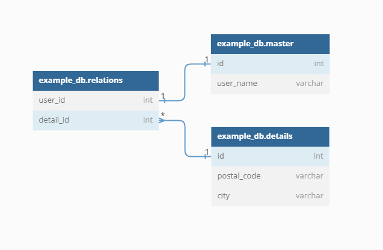

# Justificaciones: 

La estructura del software planteada ha sido con la finalidad
de que se permita añadir o extender nuevas funcionalidades. 
Por tanto, ahora se justifican alguna de las decisiones tomadas

1. **Utilización del archivo .env**: En este archivo se recoge la 
congiguración del programa realizado. Esto nos permite, en un futuro,
modificar las variables a nuestro gusto. Además, permite identificar 
que variables son relevantes para incluirlas en los configMap y utilizarlos
en kubernetes.
2. **Incluir un logger**: Se incluye el logger para recoger toda lo que ocurre dentro del software.
Para poder identificar en un futuro los posibles errores que se den.
3. **Modulo para la app ''api_module''**: En este modulo se incluye todo lo necesario para que funcione la restAPI. 
Se pueden distinguir los siguentes modulos:
   * functions: conjunto de funciones relevantes 
   * global_variables: módulo que lee las variables del .env y las utiliza en el programa.
   * schemas: modelos utilizados para intercambiar la información en los endpoints
   * logger_api: se define el logger para ir registrando qué hace el software.
   * sql_commands: define la conexión con la base de datos y funciones utiles para ejecutar los comandos. 
También es donde se recogen todos los comandos sql. 
   * routes: modulo donde se van a definir cada una de las rutas que ha de tener la API. Habrá un archivo por cada tipo de método 
HTTP que se tenga que implementar. Es decir, un modulo para get y se definen todos los endpoints relacionados con el método get
otro para patch, post... 
4. **Modulo para los test**: En este modulo se pueden distinguir 
distintas tipos de test. Los orientados a la base de datos, y los orientados
a la respuesta del servidor. 
5. **Definición de la base de datos**: Para evitar la redundancia de datos y que con 
el tiempo ocupe más espacio. Tenemos una tabla que se llama relaciones, que tiene una 
cardinalidad 1 a 1 con la tabla **master** (solo hay un usuario relacionado con un codigo postal)
y una cardinalidad de varios usuarios a 1 un codigo postal con la tabla de **details**. 

> Diagrama creado gracias a la plataforma [dbdiagram.io](dbdiagram.io)

# Metodología 

Para realizar este software se ha empleado la metodología TDD (Test Driven Development) 
e intentando aplicar en la medida de lo posible los principios SOLID.  